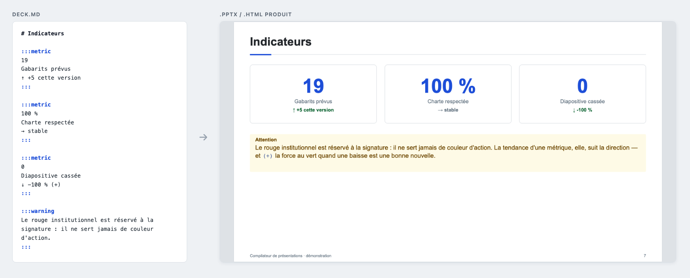
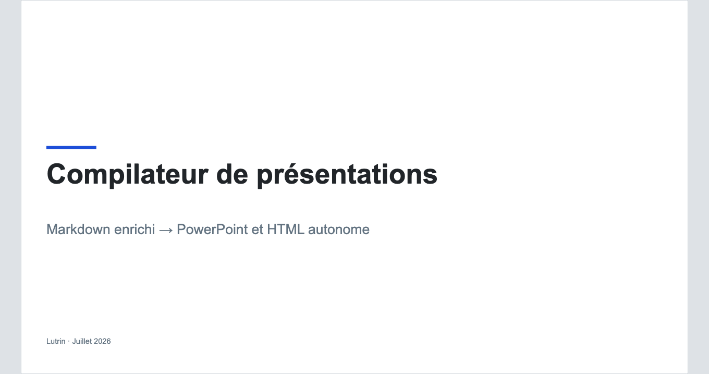
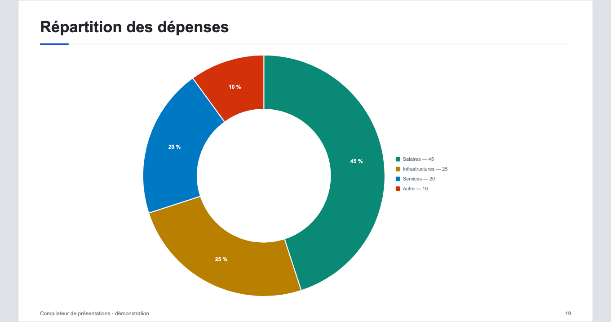
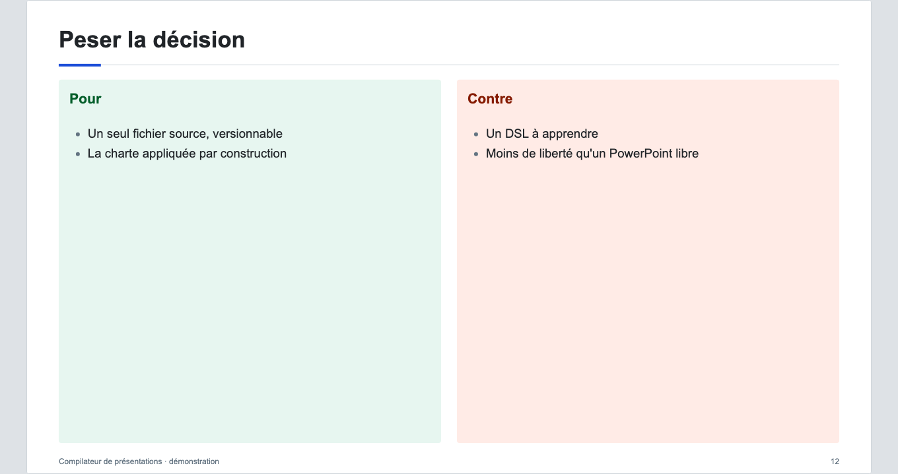

# Lutrin


[](LICENSE)

**[julien-riel.github.io/lutrin](https://julien-riel.github.io/lutrin/)** — the
landing page, with a live demo deck recompiled on every push.

**Lutrin compiles enriched Markdown into an editable PowerPoint or a
standalone HTML page, and it is the engine — not the author — that decides
the layout.**




You write the intent and the content; the compiler picks the layout, places
the blocks, guarantees legibility and produces a `.pptx` that anyone can then
open and retouch in PowerPoint. The HTML output is a single file, with a
built-in presenter mode (full screen, notes, timer, second window — the `P`
key).

Validation ships a "deck doctor": measured overflows, layouts suggested from
the content, under-resolved images. In the CLI (`--json` for agents),
underlined in VS Code (with a quick-fix) and in Obsidian.

Four entry points, one compiler (`packages/core`):

```text
                 packages/core  (parse → IR → layout → scene → renderers)
                        │
      ┌────────────┬────┴───────────┬──────────────────────┐
      ▼            ▼                ▼                      ▼
  lutrin CLI   VS Code         Obsidian plugin     agent skill (.claude/skills/deck)
  build/preview  extension       live preview,       write → validate → fix →
  validate/…     preview, export diagnostics, export build, with a visual check
```

## Getting started

Node ≥ 22 is required. Nothing else — write a `deck.md` and run:

```bash
npx lutrin build deck.md -o deck.pptx     # PowerPoint
npx lutrin build deck.md -o deck.html     # standalone HTML
npx lutrin preview deck.md                # local server, reloads on save
```

Install it once if you use it often:

```bash
npm install -g lutrin
```

To see what the DSL can actually do, start from the demo — it covers every
layout and every block type:

```bash
git clone https://github.com/julien-riel/lutrin.git
cd lutrin
npm install
npx lutrin build examples/demo.deck.md -o demo.pptx
```

Two packages are published: [`lutrin`](https://www.npmjs.com/package/lutrin)
is the command, and [`@lutrin/core`](https://www.npmjs.com/package/@lutrin/core)
is the compiler behind it — depend on the latter to call the compiler from your
own code.

The DSL — inferred layouts, `:::metric` / `:::warning` directives,
` ```chart ` charts, Mermaid, LaTeX, Lucide icons, animations, notes — is
documented in [docs/dsl.md](docs/dsl.md).

## Why not Marp / Slidev / reveal.js / Pandoc?

These tools are good, and for many uses they are the right choice. Lutrin
answers a different need, which comes down to three points:

- **A genuinely editable `.pptx`.** Marp and Pandoc can export PPTX, but most
  of the slide arrives there as an image or a frozen block; reveal.js and
  Slidev export to PDF. Lutrin writes native shapes, text boxes, tables and
  charts, with the fonts embedded: the recipient opens the file, corrects a
  figure, and moves on. That is decisive when the presentation has to be
  handed to someone who will not clone your repository.
- **The layout is decided by the engine.** Elsewhere, you write HTML/CSS or
  utility classes when the slide overflows. Here you cannot: there is no
  coordinate, no explicit column in the DSL. The engine infers a layout from
  the structure of the content and paginates whatever does not fit. It is a
  constraint, and a deliberate one — it makes decks homogeneous and
  automatable, and it deprives you of pixel-level control.
- **Validation that measures.** `lutrin validate` does not only check the
  syntax: it measures overflows, flags images too low-resolution for the area
  they occupy, proposes a layout better suited to the content, and returns
  all of it as positioned JSON — usable by an agent in a write → validate →
  fix loop.

What the others do better: web rendering (reveal.js and Slidev are far richer
in interactivity, transitions and Vue components), the ecosystem and the
documentation (Marp is mature, widely adopted, with familiar CSS themes),
all-format conversion (Pandoc remains unrivaled), and layout freedom — if
you want to place an element at a precise spot, Lutrin will tell you no.

## A few layouts

Not a single coordinate was written in the Markdown: the three slides below
come from `examples/demo.deck.md`, which has 27 of them.

| Cover | Chart | Comparison |
|---|---|---|
|  |  |  |

## CLI

```bash
npx lutrin build <deck.md> [-o output.pptx|output.html] [--kit <ref>] [--force] [--verbose]
npx lutrin preview <deck.md> [--port 4321]     # local server + auto reload
npx lutrin validate <deck.md> [--json]         # positioned diagnostics
npx lutrin inspect <deck.md>                   # IR and scenes as JSON
npx lutrin vendor <deck.md>                    # freezes the deck's external dependencies
npx lutrin capabilities [<deck.md>] [--kit <ref>]   # layouts, directives… as JSON
```

The output format is deduced from the extension of `-o`. Every compilation
command accepts `--kit <name|file.json|directory>` (see "Kits").

`capabilities` with no argument describes the **bare** engine: built-in
layouts and official catalog, `userLayouts` empty. **Passing it the deck** —
`npx lutrin capabilities my-deck.md` — honors the `kit:` of its frontmatter
and additionally publishes the kit's layouts and the `layouts/*.json` sitting
next to the `.md`: that is the form to query in a project with a brand. With
no deck, `--kit <ref>` publishes the catalog of that brand, the current
directory serving as the base. A kit asked for explicitly but not found is an
error (exit code 1, nothing on standard output) rather than a generic catalog
delivered in silence; a `layouts/*.json` that could not be read warns on the
error output only, so that `| jq` remains possible.

**`build` does not deliver a deck with errors.** If validation returns at least
one diagnostic of severity `error` — unknown directive, non-existent layout,
kit asked for explicitly but unresolvable — the command prints the errors,
exits with **exit code 1** and writes no file. `--force` compiles anyway,
errors on screen, and exits with code 0: that is for a draft you want to look
at. `validate` also exits with code 1 as soon as one error remains.

An important nuance about kits: an **explicit** kit (`--kit`, or `kit:` in the
frontmatter) that does not resolve is an error, and therefore blocks `build`.
A kit coming from an **implicit** default — project, user, editor host —
and not found returns only a warning: a stale user default must not block
the compilation of a project that asked for nothing.

## Kits — an organization's brand

A **kit** gathers a theme, its layouts, its fonts and its logos into one
distributable unit: a directory carrying a `kit.json`, or a `.deckkit`
archive. A kit travels **with the deck**, not with the binary — no
re-packaging of the VSIX or of the Obsidian plugin.

```bash
lutrin kit install <file.deckkit | https://…>   # into ~/.config/lutrin/kits/
lutrin kit list
lutrin kit remove <name>
lutrin kit create <directory>                   # produces the .deckkit
```

A kit contains only **data** — never code: installation runs nothing, refuses
any entry that would escape the kit, bounds the size and accepts only `https`.
The sha256 printed at installation is reproducible.

**No organization brand ships with Lutrin**: brand guidelines bind a trademark
— they belong to whoever holds it and live in their own repository.
`examples/kit-slate/` shows a complete, royalty-free kit, ready to copy.

Referencing a kit, by decreasing precedence:

1. CLI flag `--kit <name|file.json|directory>`;
2. frontmatter `kit:` — the name of an installed kit, a file relative to the
   deck, a kit directory, or `none` to force the generic theme:

   ```yaml
   kit: my-kit
   ```

   (`theme:` is still accepted as a deprecated alias, with a diagnostic.)
3. project default — `"lutrin": { "kit": … }` in the nearest `package.json`
   going up from the deck;
4. user default — `~/.config/lutrin/config.json` (see below);
5. host default — kit imposed by a plugin (VS Code / Obsidian) through its
   setting;
6. generic theme "Slate".

### JSON theme and layouts, without a kit

The two pieces of a kit can also be used separately, placed next to the deck:

- **JSON theme** — a file that overrides the design tokens of the default
  theme (colors, fonts — families and embedded files —, logos, chrome
  geometry, chart palette…); the derived groups (layers, callouts, trends)
  follow the palette. Any invalid entry becomes a diagnostic (`THEME_*`), and
  the WCAG thresholds are checked (`THEME_CONTRAST`). Complete template to
  copy: `packages/core/design/themes/default.json` (canonical mirror of the
  default theme, guaranteed no-op by an anti-drift test); example:
  `examples/theme-example.json`.
- **User layouts** — a `layouts/` directory defines validated aliases of the
  built-in layouts (`{ "name": "before-after", "base": "comparison",
  "sections": { "min": 2, "max": 2 } }`). Validation, "did you mean" and
  `capabilities` cover them for free — the last one on condition that it is
  passed the deck or `--kit`, failing which it does not see that directory.
  Examples: `examples/kit-slate/layouts/`.

Warm hosts (the extensions' worker, the preview server) reapply the context on
every compilation from a snapshot — never a leak of a theme or a layout
between two decks.

### User configuration — shared across projects and plugins

A kit chosen **once** applies to all your decks, in the CLI as well as in the
plugins:

```bash
lutrin config                    # directory, default kit, installed kits
lutrin config --kit my-kit       # default shared across every project
lutrin config --unset            # back to the host/generic default
```

The configuration lives in `~/.config/lutrin/` (overridable through the
`LUTRIN_CONFIG` variable; `XDG_CONFIG_HOME` honored): `config.json` carries
the user default (level 4 above), `kits/` the installed kits, referenceable by
name from any project.

In the plugins, this default is taken into account automatically (the
compilation worker reads the same configuration). The document always wins:
the frontmatter `kit:` and the project default take precedence.

## VS Code extension

Live preview (updated as you type, following the cursor), diagnostics
underlined in the editor and `.pptx` export. Files named `*.deck.md` (or
carrying `deck: true` in the frontmatter) are validated automatically; the
preview opens through the "Show Presentation Preview" command on any Markdown.

Development: open this repository in VS Code and press F5 (the build task
assembles `dist/` with the core symlinked). To produce an installable package:

```bash
npm run build -w lutrin-vscode     # esbuild → dist/
npm run vsix  -w lutrin-vscode     # → lutrin-vscode-<version>.vsix + latest.json
```

(`vsix` packages `dist/`: the build must have preceded it.) Then, in VS Code:
"Extensions: Install from VSIX…".

Settings: `lutrin.files` (glob of the decks validated by default),
`lutrin.debounceMs` and `lutrin.defaultKit` (default kit for this editor —
level 5 of the precedence above).

### Automatic updates from an internal server (optional)

Ignore this if you install the VSIX by hand. VS Code does not update an
extension installed from a VSIX on its own; for a team distributing
internally, the extension ships its own checker: publish the `.vsix` **and**
the `latest.json` (generated together by `npm run vsix`) at the same place on
a web server, then point the `lutrin.updateUrl` setting at the URL of the
`latest.json`. The extension checks on activation and then once a day, and
offers "Update". `http` URLs are refused and the sha256 digest of the manifest
is verified before installation.

## Obsidian plugin

Live preview that follows the active note (recompiled as you type), clickable
diagnostics, `.pptx` / `.html` export from the palette or the context menu,
wiki embeds `![[image.png]]` translated (the alias becomes the role:
`![[photo.png|right]]`). Desktop only — same architecture as the VS Code
extension (Node worker from the core, launched outside the renderer). See
`packages/obsidian-plugin/README.md`.

```bash
npm run build -w lutrin-obsidian                                           # dev (core symlinked)
node packages/obsidian-plugin/scripts/package.mjs --dev --vault "<vault>"  # symlink into the vault
npm run release -w lutrin-obsidian                                         # standalone plugin directory
```

## Tests

```bash
npm test                    # the three packages — node:test harness, zero dependencies
npm run test:core           # the engine alone: packages/core/test/
npm run typecheck           # the two editor hosts (tsc --noEmit)
npm run lint                # biome — BLOCKING in CI
```

`npm run lint` (`biome check .`) is run by the `format` job of the CI, which is
**blocking**: run it before you push. `npm run fmt` rewrites the formatting.

The harness covers: goldens of the IR and of the scenes on
`examples/demo.deck.md`, non-mutation of the IR by pagination, parity of the
`BLOCK_RENDERERS` tables of the two renderers, validation diagnostics.
`examples/demo.deck.md` is the renderer coverage fixture: a test fails
if a block type of the renderers does not appear in it — so every new
component must be added to it.

Regenerating the goldens after an intended change to the engine, and reading
their diff: see [CONTRIBUTING.md](CONTRIBUTING.md).

## Structure

```text
packages/core/                 the compiler + CLI (bin: lutrin)
packages/core/design/themes/   default.json — canonical mirror of the default theme
packages/core/design/layouts/  the catalog of the ten official layouts
packages/core/src/kit/         .deckkit archives (pack, download, install)
packages/core/src/worker/      the single IPC worker of the editor hosts (+ protocol.d.ts)
packages/core/test/            the node:test harness (goldens, parity, validation, kits)
packages/vscode-extension/     the extension (webview; launches the core worker)
packages/obsidian-plugin/      the Obsidian plugin (same worker, shadow DOM)
.claude/skills/deck/           the agent skill
examples/demo.deck.md          covers every layout and block type — test fixture
examples/theme-example.json    example theme
examples/kit-slate/            complete example kit (theme + layouts/, royalty-free)
site/                          the landing page — deployed to GitHub Pages with the
                               demo deck recompiled at HEAD (.github/workflows/pages.yml)
```

## Contributing, reporting

[CONTRIBUTING.md](CONTRIBUTING.md) says what is expected of a contribution —
and what will be refused. A security vulnerability goes through GitHub
Security Advisories, never through a public issue: see
[SECURITY.md](SECURITY.md).

## License

MIT. Third-party dependencies:
[THIRD-PARTY-NOTICES.md](THIRD-PARTY-NOTICES.md).
