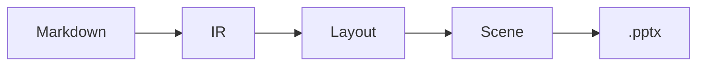

# Why a compiler?

- Markdown is not the final format: it is a description **DSL**
- Content is kept separate from page layout
- One canonical intermediate representation (IR)
- Analysis passes: layout selection, pagination, validation
- Several possible rendering engines (PPTX, HTML, PDF…)

<!-- notes: Stress the analogy with a classic compiler. -->

# The pipeline

## Front end

- Enriched Markdown
- markdown-it
- AST → IR

## Back end

- Layout engine
- PowerPoint scene
- PptxGenJS

# Architecture

- The front end produces the IR
- The layout engine places each block in a slot
- Pagination splits whatever overflows
- The renderer applies the brand



# One thing at a time

<!-- animate -->

The content of this slide appears on click, one step after another.

- Lists reveal themselves point by point
- Each block is a distinct step
- Columns and sections appear as a whole

:::success
The same steps work in PowerPoint (native animations) and in the HTML
preview (click on the slide).
:::

<!-- notes: Demonstration of the appearance animations. -->

# Comparing the approaches

| Criterion | Classic converter | Compiler |
|---|---|---|
| Page layout | Approximate CSS | Declarative layouts |
| Overflow | Truncated text | Automatic pagination |
| Diagrams | Frozen image | AST → SVG → shapes |
| Theme | Style sheet | Declarative tokens |
| Outputs | A single one | PPTX, HTML, PDF… |

# Indicators

:::metric
19
Layouts planned
↑ +5 this release
:::

:::metric
100%
Output parity
→ stable
:::

:::metric
0
Broken slides
↓ -100% (+)
:::

:::warning
The trend on a `:::metric` card is colored according to its direction: `↑`
turns green, `↓` turns red. The `(+)` suffix inverts that reflex and forces
green — to say that here a fall is good news, as in "zero broken".
:::

# Before / after

<!-- layout: comparison -->

## Classic converter

- Approximate CSS, truncated text
- A single output
- Theme by style sheet

## Compiler

- Declarative layouts, automatic pagination
- PPTX, HTML, PDF…
- Validated design tokens

# Roadmap

<!-- layout: timeline -->

## Q3 2026

Structured layouts and metric trends.

## Q4 2026

Interchangeable declarative themes.

## Q1 2027

Open-source release and example gallery.

# A layered architecture

<!-- layout: layers -->

## Outputs

.pptx PowerPoint, standalone HTML, VS Code preview.

## Renderers

PptxGenJS and HTML — same scene, same geometry.

## Engine

Layout inference, slot placement, pagination.

## IR

deck → slides → sections → blocks, source positions.

# The project at a glance

<!-- layout: swot -->

## Strengths

- Brand applied by construction
- Two outputs, a single geometry

## Weaknesses

- Embedded font ignored by Keynote

## Opportunities

- Themes for other organizations

## Threats

- Evolution of the OOXML format

# Weighing the decision

<!-- layout: pros-cons -->

## Pros

- A single source file, under version control
- The brand applied by construction

## Cons

- A DSL to learn
- Less freedom than a free-form PowerPoint

# Filing a request, step by step

<!-- layout: journey -->

## Request

Online form, five minutes.

## Review

Eligibility check within 10 days.

## Answer

Reasoned decision, sent by email.

# Project portfolio

<!-- layout: portfolio -->

## New product

Launch planned for the spring.

## Training program

Three cohorts this year.

## Energy efficiency

A third less consumption.

# Request triage

<!-- layout: funnel -->

## 2,400 received

All channels combined.

## 1,100 eligible

After checking the criteria.

## 320 selected

Funded this year.

# Detailed roadmap

<!-- layout: roadmap -->

## Q3 2026

Parameterized layouts and official catalog.

## Q4 2026

Interchangeable declarative themes.

## Q1 2027

Open-source release and example gallery.

# One figure to remember

<!-- layout: key-message -->

87% satisfaction

2026 survey of 2,400 respondents.

# Budget by quarter

The chart is rendered by the engine, in the brand's colors, with a palette
validated for color blindness and contrast.

```chart
type: bar
categories: Q1, Q2, Q3, Q4
Planned: 120, 150, 180, 210
Actual: 110, 155, 175, 190
```

# Breakdown of spending

```chart
type: doughnut
categories: Salaries, Infrastructure, Services, Other
Spending: 45, 25, 20, 10
```

# The allocation formula

The budget allocated to each team is computed as follows:

```math
B_e = \frac{\sum_{i=1}^{n} p_i \cdot c_i}{N} \times (1 + \tau)
```

where `p` is the workload, `c` the priority coefficient and `τ` the annual
indexation rate.

# Three pillars

## Speed


A compile in a few seconds.

## Reliability


Two outputs, a single geometry.

## Openness


One source file, under version control.

# Everest, north face

- A **remote** image: URL pasted as is into the Markdown
- Downloaded into the user cache, embedded in the .pptx
- Here `assets: vendor`: a copy kept in `assets/remote/`, a self-contained directory
- Photo © Luca Galuzzi — www.galuzzi.it, CC BY-SA 2.5


<!-- notes: Photo: "Everest North Face toward Base Camp", © Luca Galuzzi - www.galuzzi.it, Wikimedia Commons, CC BY-SA 2.5. The credit must stay close to the image (the author's requirement). -->

# Panorama from the Fronalpstock


Photo © Hannes Röst — Wikimedia Commons, CC BY-SA 3.0

<!-- notes: Photo: "Fronalpstock, Switzerland", Hannes Röst, Wikimedia Commons, CC BY-SA 3.0. hero layout: full-page image. The credit stays visible on the slide (a CC BY-SA requirement). -->

# A word from users

> You write a presentation the way you write code: a source language, an
> intermediate representation, optimization passes.
>
> — A convinced author

# The code stays readable

```ts
function compile(source: string): Deck {
  const ast = parse(source); // markdown-it
  const ir = lower(ast);
  return layout(ir); // placement + pagination
}
```

# A kit fits in a manifest

Installing an organization's brand means copying a directory. Its heart is a
`kit.json` — data only, never code.

```json
{
  "name": "slate-plus",
  "version": "1.0.0",
  "theme": "./theme.json",
  "layouts": "./layouts"
}
```

# Next steps

- Mermaid diagrams rendered as native shapes
- HTML engine (reveal.js) and PDF engine (Typst)
- Dynamic components (github-stats, chart, sql)
- Fragments and animations
- Interchangeable declarative themes
- Accessibility checker (contrast, reading order)
- Hot preview while editing
- Example gallery
- Visual regression tests
- Incremental compilation cache
