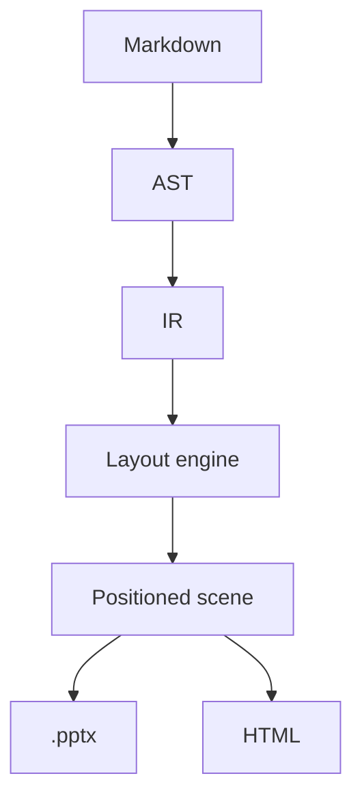

# Two kinds of time

<!-- layout: section -->

<!-- notes: Open on the cost, not on the tool. Everyone in the room has lost an afternoon to a deck. -->

# Every deck costs you twice

- Once to work out **what you have to say**
- Once to nudge the box two pixels to the left
- Pick the blue again, off the slide that already had it
- Shrink the text until it fits — differently on every slide
- Redo all of it when the numbers change on Thursday

Only the first one was ever your job.

<!-- notes: The second list is deliberately mundane. Recognition is the argument. -->

# You write the content. The engine does the geometry.

<!-- layout: key-message -->

# How a deck gets made

<!-- layout: before-after -->

## By hand

- Duplicate yesterday's slide
- Delete its content, keep its boxes
- Drag, align, resize, recolour
- Discover on the projector that one title wrapped

## By compiler

- Write the content in Markdown
- Run `lutrin build deck.md`
- Read the diagnostics, if any
- Hand over a `.pptx` anyone can open

# The trade

<!-- layout: pros-cons -->

## What you get

- Layouts chosen for you, from what you wrote
- The brand applied by construction, not by discipline
- A deck that rebuilds itself when the numbers change
- Text and figures under version control, diffable

## What you give up

- Placing one element at one exact spot
- CSS overrides and escape hatches
- Art direction on a single slide
- Any argument about which blue it was

# How it works

<!-- layout: section -->

# A compiler, in the literal sense

<!-- layout: split -->

Not a converter with a stylesheet attached. A front end, one intermediate
representation, analysis passes, and two renderers that share a single
geometry.


```mermaid
flowchart TD
  MD[Markdown] --> AST[AST]
  AST --> IR[IR]
  IR --> LAY[Layout engine]
  LAY --> SCENE[Positioned scene]
  SCENE --> PPTX[.pptx]
  SCENE --> HTML[HTML]
```

# The five passes

<!-- layout: journey -->

## Parse

Markdown, plus directives, into an AST.

## Lower

Deck, slides, sections, blocks — source positions kept.

## Layout

A layout inferred, every block given a slot.

## Scene

One positioned geometry, in absolute units.

## Render

Two outputs from that one scene.

<!-- notes: Insist on "one scene, two renderers". That is what makes the outputs agree. -->

# Where each piece lives

<!-- layout: layers -->

## Outputs

`.pptx` for PowerPoint and Keynote, one standalone HTML file for the browser.

## Renderers

Native shapes, text boxes and tables — or inlined SVG and CSS.

## Engine

Layout inference, slot placement, pagination, auto-fit.

## Representation

`deck → slides → sections → blocks`, each carrying its source position.

# What you write becomes what you see

<!-- layout: table -->

| You write | The engine draws |
|---|---|
| `# Heading` | A new slide, titled |
| `## Section` | A slot: column, panel, band or quadrant |
| `- item` | A bullet, sized to the room left |
| `:::metric` | An indicator card with its trend |
| ` ```chart ` | A chart, in the brand's palette |
| `<!-- layout: swot -->` | Four quadrants, aligned |

# One scene, two outputs

<!-- layout: two-columns -->

## PowerPoint

Native shapes, real text boxes, real tables. Fonts embedded. The recipient
corrects a figure and moves on — no repository to clone, no toolchain to
install.

## Standalone HTML

One file, everything inlined. Press <kbd>P</kbd> to present, <kbd>N</kbd> for
speaker notes and a timer. Nothing is fetched from the network.

# The compiler talks back

:::info
`SLIDE_PAGINATED` — the content did not fit, so it continues on a second slide.
:::

:::success
`2/2 remote images` — both photographs were fetched and embedded. The deck is self-contained.
:::

:::warning
`IMAGE_UPSCALED` — the image is smaller than the area it fills; it will look soft.
:::

:::danger
`BLOCK_OVERFLOW` — already at the densest step, and it still does not fit. Cut something.
:::

<!-- notes: These four are real diagnostics, quoted verbatim. Forty-odd exist. -->

# What it draws

<!-- layout: section -->

# Indicators

:::metric
33
Layouts available
↑ +2 this release
:::

:::metric
15
Chart types
↑ +7 this release
:::

:::metric
0
Coordinates in this file
→ by design
:::

# Budget by quarter

The chart is drawn by the engine, in the brand's colours, on a palette checked
for contrast and colour blindness.

```chart
type: bar
categories: Q1, Q2, Q3, Q4
Planned: 120, 150, 180, 210
Actual: 110, 155, 175, 190
target: 165
```

# Breakdown of spending

```chart
type: doughnut
categories: Salaries, Infrastructure, Services, Other
Spending: 45, 25, 20, 10
```

# From opening to closing balance

```chart
type: waterfall
categories: Opening, Grants, Salaries, Tooling, Closing
Budget: 400, 180, -260, -70, 250
totals: Opening, Closing
```

# Choosing the platform

```chart
type: rating
categories: Fit to process, Cost of change, Risk, Time to deliver
Rebuild in house: 4, 2, 4, 2
Buy the module: 2, 5, 2, 5
Extend what we have: 3, 4, 3, 3
scale: 5
```

# Coverage by team

```chart
type: heat
categories: Discovery, Build, Test, Run
Payments: 4, 5, 3, 2
Identity: 5, 4, 4, 3
Reporting: 2, 3, 2, 1
scale: 5
```

# Delivery plan

```chart
type: gantt
categories: Q1, Q2, Q3, Q4
now: Q3
Discovery: Q1 - Q2
Build: Q2 - Q3
Pilot: Q3 - Q4
Rollout: Q4 - Q4
```

# Where the programme stands

<!-- layout: status-list -->

## Delivery

:::progress success
100 %
Online services
Delivered in April
:::

:::progress warning
45 % / 80 %
Paper forms
Under analysis, against an 80 % commitment
:::

## Commitments

:::status
Scope, Schedule, Quality
!Budget
!!Recruitment
:::

Each commitment carries an ==Owner==; one that slips is tagged ==!At risk==.

# Two teams out of five have switched

<!-- layout: pictogram -->

:::progress
38 %
Teams on the new pipeline
:::

Every dot is one team. No scale to read, no axis to follow — the picture is the
number.

# The project at a glance

<!-- layout: swot -->

## Strengths

- One source of truth, in version control
- The brand applied by construction

## Weaknesses

- No pixel-level control, ever
- A DSL to learn, however small

## Opportunities

- Decks generated by an agent, then checked
- One kit, every deck in the organization

## Threats

- A slide that genuinely needs art direction
- Evolution of the OOXML format

# Programme log

<!-- layout: raid -->

## Risks

Recruitment slipping into the next quarter.

## Assumptions

The kit is ready before the pilot starts.

## Issues

Two source systems still disagree on totals.

## Dependencies

The identity service, delivered by another team.

# Effort and impact

<!-- layout: priority-matrix -->

## Do first

Automated build in CI.

## Plan

Kit for the whole organization.

## Quick wins

Diagnostics in the editor.

## Later

Extra export formats.

# Request triage

<!-- layout: funnel -->

## 2,400 received

All channels combined.

## 1,100 eligible

After checking the criteria.

## 320 selected

Funded this year.

# What holds it up

<!-- layout: pyramid -->

## One deck, on brand

What the audience sees.

## Layouts and kits

Chosen by the engine, owned by the organization.

## One geometry

Computed once, rendered twice.

# Roadmap

<!-- layout: roadmap -->

## Q3 2026

Widgets for status boards and scorecards.

## Q4 2026

Kit editor, and images addressed by name.

## Q1 2027

Incremental builds and a visual regression suite.

# Three reasons it holds

<!-- layout: pillars -->

## Speed


A deck is a file. Change a figure, rebuild, hand it over.

## Consistency


The brand is in the kit, not in your muscle memory.

## Traceability


Diffable, reviewable, and rebuilt by CI like any other artefact.

# On images

<!-- layout: split -->

- A local file, or a URL fetched at build time
- With `assets: vendor`, a copy is kept next to the deck
- The result is self-contained: no live network, ever
- Under-resolution is measured and reported, not discovered on the projector


Photo © Luca Galuzzi — Wikimedia Commons, CC BY-SA 2.5

# A photograph fills the frame


Photo © Hannes Röst — Wikimedia Commons, CC BY-SA 3.0

# The allocation formula

The budget allocated to each team is computed as follows:

```math
B_e = \frac{\sum_{i=1}^{n} p_i \cdot c_i}{N} \times (1 + \tau)
```

where `p` is the workload, `c` the priority coefficient and `τ` the annual
indexation rate.

# The code stays readable

<!-- layout: code -->

```ts
export function pickLayout(slide: Slide): LayoutName {
  if (slide.blocks.every(isMetric)) return 'metrics';
  if (slide.sections.length === 4) return 'swot';
  if (slide.blocks.some(isChart)) return 'chart';
  return 'content';
}
```

# A brand fits in a manifest

<!-- layout: code -->

```json
{
  "name": "acme",
  "colors": { "primary": "#0F766E", "accent": "#B45309" },
  "fonts": { "heading": "Acme Grotesk", "body": "Acme Text" },
  "logo": "./logo/acme.svg"
}
```

# One point at a time — press → to reveal

<!-- animate -->

<!-- notes: This slide is deliberately empty until the first click. That is what `<!-- animate -->` does: one step per block, native animations in the .pptx too. -->

- A deck can hold its points back and release them one by one
- One line in the file, `<!-- animate -->`, and every block becomes a step
- The `.pptx` gets real PowerPoint animations, not a stack of duplicated slides
- Which is why this slide looks empty until you press the arrow

# Four shapes an outline cannot make

<!-- layout: cycle -->

<!-- notes: These four slides are the diagram families. Ask for `--smartart` and they leave as real, editable SmartArt in PowerPoint. -->

## Plan

Scope agreed with the sponsors.

## Build

Two-week iterations.

## Review

Adoption dashboard.

## Ship

# Who reports to whom

<!-- layout: hierarchy -->

- Delivery
  - Engineering
    - Platform
    - Product
  - Design
  - Operations

# Where the three overlap

<!-- layout: venn -->

## Desirable

## Feasible

## Viable

# The compiler and what leans on it

<!-- layout: radial -->

Compiler core

## CLI

## VS Code

## Web playground

## CI

# A word from the people who use it

<!-- layout: quote -->

> I stopped opening PowerPoint to make a deck. I open it to read the one the
> build gave me.
>
> — A programme lead, after the third rebuild in one week

# Start in one line

<!-- layout: focus -->

`npx lutrin build deck.md -o deck.pptx`

Node 22 or later. Nothing else to install. MIT.

<!-- notes: Hand out the URL here. The .pptx of this very deck is on the site. -->
