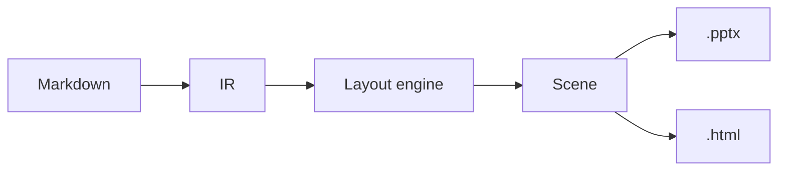

# How to read this deck

- Every slide here is **built with the feature it documents**: the slide
  about columns has columns, the SWOT slide is a SWOT, the icon slide is
  full of icons
- Read `examples/reference.deck.md` side by side with the output — the
  source is its own user guide
- The complete prose reference lives in `docs/dsl.md`; the showcase deck is
  `examples/demo.deck.md`

:::info
Compile me: `npx lutrin build examples/reference.deck.md -o reference.html`
— or `-o reference.pptx` for PowerPoint. Same source, same geometry.
:::

<!-- notes: This deck is the user guide. Each slide names the feature that renders it. -->

# The language

# One file, a whole deck

- `# title` starts a new slide; a `---` rule starts one too
- A `# title` with **no content at all** becomes a section divider — like
  the slide just before this one
- `## subtitle` opens sections inside a slide: columns, panels or
  milestones, depending on the layout
- `###` and deeper stay in the flow — subheadings that never split a slide
  nor open a section
- Three comments drive everything else: `<!-- layout: … -->`,
  `<!-- notes: … -->` and `<!-- animate -->`
- Never write geometry: no colors, no sizes, no positions — describe the
  content and let the engine place it

# The cover comes from the frontmatter

```yaml
---
title: The Lutrin reference
subtitle: Every layout and directive, demonstrated by the tool itself
author: Lutrin
date: July 2026
footer: Lutrin · DSL reference   # defaults to the title
kit: my-organization             # optional — an installed brand kit
animate: true                    # optional — animate the whole deck
assets: vendor                   # optional — keep remote copies local
---
```

<!-- notes: A code block alone on a slide is rendered with the code layout — this slide demonstrates it. -->

# Every slide finds its layout

| You write | The engine picks |
|---|---|
| Title and text | `content`, paginated |
| A title alone | `section` |
| Two or three `##` sections | `two-columns` / `three-columns` |
| Text plus a visual | `split` |
| A `cover` or `background` image | `hero` |
| A dominant table | `table` — this very slide |
| Two or more `:::metric` cards | `metrics` |
| A quotation alone | `quote` |
| A code block alone | `code` |
| A diagram alone | `diagram` |
| A chart alone | `chart` |

# Reveal step by step

<!-- animate -->

One comment, `<!-- animate -->`, and this slide appears on click:

- Lists reveal themselves point by point
- Columns, panels and metrics arrive as whole blocks
- `animate: true` in the frontmatter animates the entire deck;
  `<!-- animate: none -->` exempts one slide
- `<!-- animate: fade -->` — or `wipe`, `zoom`, `appear` — forces one
  effect; `animate: fade` in the frontmatter, deck-wide

:::success
The same steps are native on-click animations in PowerPoint and a
click-to-reveal in the HTML. Covers and section slides never animate.
:::

# Notes for the presenter

- Write `<!-- notes: … -->` anywhere in a slide — invisible on screen
- In the `.pptx`, they land in the native notes pane
- In the HTML, they sit under each slide, and the presenter view (press
  `N` in presentation mode) shows them with the timer and the next slide
- This slide carries one — go find it in the source

<!-- notes: Found me. This is what your audience never sees. -->

# What the DSL refuses to do

- There is **no syntax** for coordinates, sizes, explicit columns or colors
  — that is the contract, not a gap
- A need for positioning is a layout to request with `<!-- layout: … -->`
- A recurring shape of your own is a custom layout to define in
  `layouts/*.json`
- A color to change belongs in a kit's theme, never in the Markdown

:::warning
Anything you hard-code in the text, the next brand cannot restyle. Describe
meaning; let the kit carry the look.
:::

# Layouts by inference

# Two columns

## What you write

- Two `##` headings under one `#` title
- Anything under each heading: lists, text, an icon, an image

## What you get

- Two equal columns, headers styled by the theme
- Three headings give three columns; beyond that, prefer `grid`

# Icons head a column

## Primary


`` — any of ~2000 icons from lucide.dev, rendered in the
theme's primary color by default.

## Neutral


`` uses the body-text ink — quieter, for secondary
points.

## Secondary


`secondary` and `white` complete the permitted inks — `white` is for dark
panels only.

# Text and a visual

- `` — the engine places the visual; text takes 42% of the
  width, the visual the rest
- `` or `` forces the side
- A remote URL is downloaded **at compile time** and embedded: the deck
  never phones home during the show
- A missing image degrades to a clean placeholder, never a broken slide
- Photo © Luca Galuzzi — www.galuzzi.it, CC BY-SA 2.5


<!-- notes: Photo: "Everest North Face toward Base Camp", © Luca Galuzzi - www.galuzzi.it, Wikimedia Commons, CC BY-SA 2.5. The credit must stay close to the image. -->

# One image, full frame


`` or `` fills the page — photo © Hannes Röst,
Wikimedia Commons, CC BY-SA 3.0

<!-- notes: hero layout: the image fills the 1280 × 720 frame; title and caption stay legible on top. -->

# Numbers that pop

:::metric
31
Layouts available
↑ +10 with the catalog
:::

:::metric
7
Chart types
→ stable
:::

:::metric
0
External requests at show time
↓ -100% (+)
:::

:::info
The last line of a `:::metric` card is the trend: `↑` turns green, `↓`
red, `→` gray. The `(+)` suffix makes a fall good news — like this zero.
Past the layout's ceiling of four cards, `METRICS_DROPPED` reports the rest.
:::

# Callout boxes

Four semantic asides, tinted by the theme — one fenced block each. A
callout keeps paragraphs and bullet lists; any other block inside is
dropped with `ALERT_CONTENT_DROPPED`:

:::info
Use `:::info` for context the audience may skip.
:::

:::success
Use `:::success` for what is settled and working.
:::

:::warning
Use `:::warning` for the caveat that saves a support ticket.
:::

:::danger
Keep `:::danger` for the step where something can be lost.
:::

# Words worth quoting

> A quotation standing alone becomes the whole slide. Give it an
> attribution line and the engine sets both.
>
> — The `quote` layout, on itself

# Diagrams are compiled too



<!-- notes: A Mermaid block alone gets the diagram layout, full frame. Rendered to an image at compile time by a browser already on the machine (Chrome, Edge, Brave or Chromium; LUTRIN_BROWSER picks one). With no browser found, a readable fallback shows the source — lutrin setup-mermaid diagnoses and can download one. -->

# Charts from data

- A fenced ` ```chart ` block with a line-per-line spec
- `type:` one of `bar`, `barh`, `line`, `area`, `pie`, `doughnut`, `radar`
- Each `Name: v1, v2, …` line is a series — decimals with a point,
  `pie` and `doughnut` take a single series
- Colors come from the theme's validated palette — never picked by hand
- Charts ship as images: faithful in Keynote and QuickLook, deliberately
  not editable in PowerPoint
- An invalid spec degrades to a visible code block

```chart
type: bar
categories: Q1, Q2, Q3, Q4
Drafted: 8, 12, 15, 21
Delivered: 6, 11, 14, 19
```

# A chart, full frame

```chart
type: line
categories: Jan, Feb, Mar, Apr, May, Jun
Decks compiled: 4, 9, 15, 22, 31, 44
Hours saved: 2, 5, 9, 14, 21, 30
```

# Equations

A ` ```math ` block — ` ```latex ` and ` ```tex ` work too, as does
`$$…$$` alone in a paragraph — is rendered through MathJax and centered at
its natural size:

```math
S = \frac{\sum_{i=1}^{n} p_i \cdot c_i}{N} \times (1 + \tau)
```

Without `mathjax-full` installed, a readable fallback shows the source.

# Layouts on request

# Eight structured intents

Eight layouts express an intent the content alone cannot reveal — ask with
`<!-- layout: … -->`; each `##` becomes a panel, and brevity is enforced:

| Layout | Sections | Intent |
|---|---|---|
| `comparison` | exactly 2 | before / after, target highlighted |
| `pillars` | 2 – 4 | guiding principles, accented |
| `timeline` | 2 – 6 | milestones on an arrowed axis |
| `layers` | 2 – 5 | a stack, base to surface |
| `swot` | exactly 4 | the 2 × 2 classic |
| `grid` | 2 – 8 | a mosaic of panels |
| `steps` | 2 – 6 | a process, arrow-joined |
| `focus` | — | one message, full frame |

# Ask, don't hint

<!-- layout: comparison -->

## Thirteen by inference

Text, tables, images: the engine reads the content and picks the layout —
the table at the start of this deck is the whole contract.

## Eighteen on request

`<!-- layout: … -->` names a structured or official layout. Validation
checks the section bounds and suggests the right name when you mistype.

# Three pillars, held up

<!-- layout: pillars -->

## Content first


You write meaning — never geometry, never colors.

## Brand by construction


The kit carries palette, fonts and logos; the deck stays untouched.

## One scene, two outputs


The `.pptx` and the HTML share identical, pixel-for-pixel geometry.

# A deck takes shape

<!-- layout: timeline -->

## Phase 1

Draft the story in Markdown.

## Phase 2

Validate — fix every diagnostic.

## Phase 3

Compile to HTML, judge the density.

## Phase 4

Build the `.pptx` and present.

# The engine, in layers

<!-- layout: layers -->

## Outputs

`.pptx` PowerPoint, standalone HTML, live preview.

## Renderers

PptxGenJS and HTML — one scene, one geometry.

## Layout engine

Inference, slot placement, pagination.

## IR

deck → slides → sections → blocks, with source lines.

<!-- notes: A layers slide also accepts a single bullet list — one item per layer. -->

# Markdown decks, honestly

<!-- layout: swot -->

## Strengths

One source file under version control; the brand applies itself.

## Weaknesses

A syntax to learn; less freedom than a free-form canvas.

## Opportunities

A kit per organization; CI compiles the deck on every push.

## Threats

Hand edits to the `.pptx` are lost at the next build.

# A mosaic of panels

<!-- layout: grid -->

## Cells

Two to eight `##` sections, placed row by row.

## Columns

Two by default — `portfolio` shows three, with headers.

## Headers

The `headed` parameter detaches a title bar per card.

## Tints

Cells can take semantic tints — `risk-map` runs green to red.

# A slide through the engine

<!-- layout: steps -->

## Parse

Markdown becomes blocks that remember their source line.

## Analyze

The layout is inferred — or read from your directive.

## Place

Every block lands in a slot on the 1280 × 720 grid.

## Render

The same scene goes out as `.pptx` and as HTML.

# The golden rule

<!-- layout: focus -->

Describe the content.

Geometry belongs to the engine and brand belongs to the kit — nothing in
this whole deck sets a color, a size or a position.

# The official catalog

# Ten named intents

Ten official layouts ship with the engine — pure data built on the
structured bases, always available, suggested by validation when your
headings betray the intent:

| Layout | Base | Intent |
|---|---|---|
| `before-after` | comparison | current state → target |
| `pros-cons` | comparison | weighing a decision |
| `roadmap` | timeline | dated milestones, in a column |
| `journey` | steps | the path of a request or user |
| `priority-matrix` | grid | effort / impact quadrants |
| `risk-map` | grid | probability / severity, tinted |
| `funnel` | layers | volumes narrowing step by step |
| `pyramid` | layers | apex to foundations |
| `key-message` | focus | the figure that must stick |
| `portfolio` | grid | offerings as a mosaic |

# Why compile at all

<!-- layout: before-after -->

## By hand

Geometry drifts slide by slide, the brand varies by author, reuse is
copy-paste.

## Compiled

Geometry is constant, the brand comes from the kit, the source lives under
version control.

# Naming the intent

<!-- layout: pros-cons -->

## Pros

- The reader sees the intent instantly
- Validation checks the section bounds for you

## Cons

- One more name to remember
- Brevity is enforced — panels never paginate

# Adopting Lutrin

<!-- layout: roadmap -->

## Week 1

Write, validate and build a first deck with the neutral theme.

## Week 2

Install the organization kit — the brand applies itself.

## Week 3

Custom layouts, and CI compiling the deck on every push.

# From idea to applause

<!-- layout: journey -->

## Write

One Markdown file, content only.

## Validate

Fix every diagnostic it reports.

## Build

HTML to judge, `.pptx` to deliver.

## Present

Notes, animations, presenter view.

# Where to spend effort

<!-- layout: priority-matrix -->

## Quick wins

Run `validate` before every build.

## Big bets

A kit that carries your organization's brand.

## Fill-ins

Presenter notes and step-by-step reveals.

## Time sinks

Hand-tuning geometry the engine will redo anyway.

# What can go wrong

<!-- layout: risk-map -->

## Unknown icon

A warning; the icon is skipped, the slide survives.

## Missing image

A clean placeholder, never a broken slide.

## Overflowing panel

`BLOCK_OVERFLOW` tells you exactly what to trim.

## Missing explicit kit

The build stops — fix the reference rather than force it.

# From many to one

<!-- layout: funnel -->

## 31 layouts

Everything the engine can place on a slide.

## 10 named intents

The official catalog distills the common cases.

## 1 golden rule

Describe the content; the engine does the rest.

# Build the argument

<!-- layout: pyramid -->

## The message

The one sentence the room should remember.

## The arguments

The three reasons that carry it.

## The evidence

Data, quotations and charts underneath.

# One number to keep

<!-- layout: key-message -->

31 layouts, one source file

Every one of them is demonstrated in this deck — whose Markdown source is
its own user guide.

# One engine, three hosts

<!-- layout: portfolio -->

## CLI

`build`, `validate`, `preview`, `vendor`, `capabilities`.

## VS Code

Live preview and diagnostics as you type.

## Obsidian

The same engine, wiki embeds translated.

# Kits and themes

# One deck, any brand

A **kit** is a directory with a `kit.json` manifest — theme tokens, fonts,
logos, layouts; data only, never code. Requested explicitly and not found,
a kit **stops the build** — only implicit defaults fall back silently to
Slate. Who wins, strongest first:

1. The `--kit <ref>` flag on the command line
2. The `kit:` frontmatter key — a name, a directory or a JSON file that
   travels with the deck; the document beats any configuration
3. The project default in the nearest `package.json`
4. The user default set by `lutrin config --kit <ref>`
5. A host default (VS Code, Obsidian) — else the neutral Slate theme

<!-- notes: lutrin kit list shows what is installed. kit: none forces the neutral theme. theme: is a deprecated alias of kit: and warns with KIT_DEPRECATED_KEY. -->

# The theme is data

Design tokens in JSON — the palette drives layers, panels, diagrams and
icons; `chartColors` stays an independent, accessibility-checked palette:

```json
{
  "name": "My organization",
  "colors": { "primary": "0B5394", "primaryDarker": "073763" },
  "fonts": { "body": "My Font", "files": { "regular": "./fonts/MyFont.ttf" } },
  "logos": { "cover": "./logo.png", "section": "./logo-white.png" },
  "chartColors": ["0B5394", "B87F00", "0A8A76", "D3310A", "005E99", "8A5C00"]
}
```

An invalid entry is dropped with a diagnostic, never a broken build — and
validation checks the WCAG contrast thresholds on every applied theme.

# Layouts of your own

A `layouts/*.json` file next to the deck builds on any base — parameters
come from `capabilities().layoutParams`, values are semantic tokens, never
raw colors:

```json
{
  "name": "pros-cons-custom",
  "base": "comparison",
  "sections": { "min": 2, "max": 2 },
  "panels": ["success", "danger"],
  "description": "Decision: pros in green, cons in red."
}
```

Ask for it like any other: `<!-- layout: pros-cons-custom -->`. A complete
kit with layouts ships in `examples/kit-slate/`.

# The toolchain

# From draft to deliverable

1. Run `lutrin validate deck.md` — positioned diagnostics, `--json` for
   machines; exit code 1 while an error remains
2. Build: `lutrin build deck.md -o deck.html --verbose` — same verdict:
   one error and nothing is written
3. Open the HTML — its geometry is exactly the `.pptx`'s
4. Ship: `lutrin build deck.md -o deck.pptx`

- `lutrin preview` — local server, recompiles as you edit
- `lutrin vendor` — freezes images, diagrams and kit for offline builds
- `lutrin capabilities deck.md` — what this deck can actually use, as JSON
- `--force` compiles despite errors — for showing a draft, never a fix

# The compiler talks back

Three severities: `error` blocks the build, `warning` flags a probable
mistake, `info` notes an automatic behaviour. The classics:

| Code | Severity | Meaning |
|---|---|---|
| `UNKNOWN_LAYOUT` | error | no such layout — with a "did you mean" |
| `UNKNOWN_DIRECTIVE` | error | no such `:::name` |
| `KIT_NOT_FOUND` | error | explicit kit missing |
| `LAYOUT_SECTIONS` | warning | `##` count outside the layout's bounds |
| `BLOCK_OVERFLOW` | warning | a panel's content will not fit |
| `MISSING_IMAGE` | warning | file not found — placeholder shown |
| `THEME_CONTRAST` | warning | a theme misses the WCAG thresholds |
| `LAYOUT_SUGGESTION` | info | your headings betray a known intent |
| `SLIDE_PAGINATED` | info | the slide split into "(cont.)" |

# What the engine guarantees

- Overflowing lists and tables **paginate** into "(cont.)" slides, with a
  Morph transition in PowerPoint — never shorten content to fit
- The default theme meets WCAG thresholds; any applied theme is checked
- Missing images, icons and invalid charts degrade to something readable
- No kit means no logo and an Arial fallback: normal, not a bug

:::success
Renderer parity is tested: the `.pptx` and the HTML come from the same
scene, block for block, pixel for pixel.
:::

# Where to go next

- `docs/dsl.md` — the complete prose reference, edge cases included
- `examples/demo.deck.md` — the showcase this deck is the manual for
- `examples/kit-slate/` — a full kit: theme, fonts and custom layouts
- `npx lutrin capabilities <deck.md>` — the authoritative answer to "is
  this supported?"
- When in doubt, ask the compiler — it talks back

<!-- notes: End on the loop: write, validate, build, present. -->
