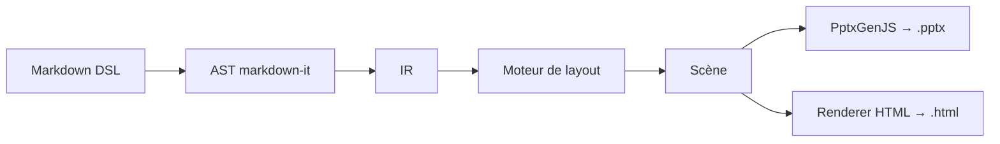
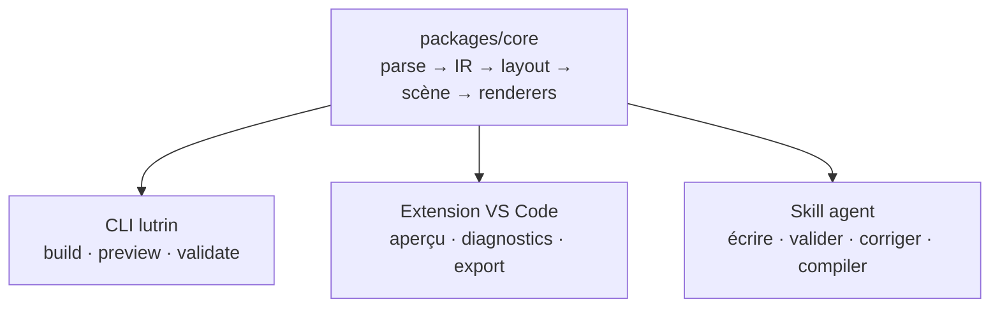

# Ce que fait Lutrin

<!-- layout: focus -->

Vous écrivez l'intention et le contenu ; le compilateur choisit la mise en page.

Lutrin transforme du **Markdown enrichi** — un DSL qui décrit le contenu, jamais des coordonnées — en un **PowerPoint réellement éditable** ou une **page HTML autonome**. Pas de CSS, pas de colonnes explicites, pas de pixels : le moteur infère la disposition, place les blocs, garantit la lisibilité et pagine ce qui déborde.

# La chaîne de compilation

<!-- notes: Un seul pipeline, deux sorties issues de la même scène — géométrie identique au pixel près sur la grille 1280 × 720. -->

# Le principe : séparer le fond de la forme

<!-- layout: comparison -->

## L'auteur écrit

Le **contenu** et son intention : titres, listes, métriques, tableaux, graphiques.

Aucune couleur, aucune taille, aucune position.

Il décrit *quoi* dire, pas *où* le poser.

## Le moteur décide

La **mise en page** : layout inféré, placement des slots, pagination anti-débordement.

Il suit les jetons de design du thème actif.

Résultat homogène et automatisable, de bout en bout.

# Ce qui distingue Lutrin

<!-- layout: pillars -->

## PPTX vraiment éditable

Des formes, zones de texte et tableaux natifs, polices embarquées — dès l'installation, sans LibreOffice ni navigateur.

## Layout décidé par le moteur

Pas de coordonnée dans le DSL : la disposition est inférée de la structure, ce qui déborde est paginé.

## Validation qui mesure

Le « deck doctor » mesure les débordements, signale les images trop faibles, propose un meilleur layout — en JSON positionné.

# Les mises en page inférées

Le moteur lit la structure du contenu et choisit tout seul.

| Contenu de la diapositive | Layout choisi |
|---|---|
| Première diapo texte seul | `cover` |
| Un titre seul | `section` |
| Texte + visuel (image, chart, mermaid) | `split` |
| ≥ 2 blocs `:::metric` | `metrics` |
| Tableau dominant | `table` |
| Citation seule | `quote` |
| 2 ou 3 sections `##` | `two/three-columns` |
| Tout le reste | `content` (flux paginé) |

# Des layouts structurés sur demande

<!-- layout: grid -->

## comparison

Avant / après, deux panneaux.

## pillars

Piliers, principes directeurs.

## timeline

Jalons numérotés sur un axe.

## swot

Matrice 2 × 2 sémantique.

## steps

Processus séquentiel fléché.

## cycle · venn · hierarchy

Diagrammes : boucle, intersections, arbre.

# La validation en trois temps

<!-- layout: steps -->

## Écrire

Un fichier `.md` qui décrit le contenu selon le DSL.

## Valider

`lutrin validate` : débordements mesurés, layouts suggérés, images sous-résolues — en JSON pour un agent.

## Compiler

`lutrin build` refuse de livrer un deck porteur d'une seule erreur : exit 1, aucun fichier écrit.

# Deux sorties, une seule scène

<!-- layout: comparison -->

## PowerPoint (.pptx)

Formes natives, tableaux, polices embarquées. Charts, équations et icônes en images vectorielles + raster.

Animations natives « au clic », transition Morph entre diapos de même titre.

## HTML autonome

Un seul fichier : polices woff2, images, SVG tout inlinés. Aucune requête réseau.

Mode présentateur intégré : plein écran, notes, minuteur, seconde fenêtre.

# Le thème et les kits

<!-- layout: comparison -->

## Sans kit — thème « Slate »

Le défaut neutre : bleu, Arial, pas de logo. Conforme aux seuils WCAG (encres ≥ 4.5:1, charts ≥ 3:1).

C'est normal, pas un bug.

## Avec un kit d'organisation

Une marque distribuée en `.deckkit` : palette, typographie, logos, layouts. Le kit voyage **avec le document**.

Police embarquée dans le .pptx, signature sur les diapos.

# Pourquoi pas Marp, Slidev ou reveal.js ?

<!-- layout: pillars -->

## Un .pptx éditable par défaut

Formes natives depuis un pipeline Node pur — là où d'autres exportent une image par diapo ou exigent LibreOffice.

## Une contrainte assumée

Aucune coordonnée possible : decks homogènes et automatisables, au prix du contrôle au pixel.

## Une validation mesurée

Bien plus qu'une vérification de syntaxe : le moteur mesure et corrige dans une boucle écrire → valider → corriger.

# L'architecture du dépôt

<!-- notes: Un monorepo npm workspaces : un seul compilateur, trois points d'entrée — CLI, extension VS Code, skill agent. -->

# La ligne de commande

- `lutrin new deck.md` — un deck de départ qui compile déjà
- `lutrin build deck.md -o deck.pptx` — PowerPoint (ou `.html`, `.pdf`, `--png`)
- `lutrin preview deck.md` — serveur local, recompilation à la sauvegarde
- `lutrin validate deck.md --json` — diagnostics positionnés (exit 1 si erreur)
- `lutrin capabilities deck.md` — layouts, directives, charts supportés
- `lutrin vendor deck.md` — fige les dépendances externes dans le dossier
- `lutrin kit install / list / create` — gérer les marques d'organisation

# En résumé

<!-- layout: focus -->

Décrivez le contenu. Le moteur fait le reste.

Lutrin est un compilateur de présentations *themable* : un thème neutre par défaut, des marques d'organisation via des kits. Node ≥ 22, MIT, publié sur npm (`lutrin` et `@lutrin/core`). Trois points d'entrée — CLI, VS Code, skill agent — un seul moteur.
