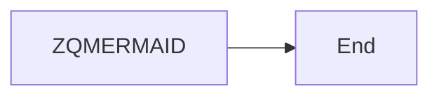

# Paragraph and bullets

Sample paragraph ZQPARA in **bold** and *italic*.

- Sample bullet ZQBULLET
- Second bullet

# Table

| Column ZQHEADER | Column ZQHEADER2 |
|---|---|
| Cell ZQCELL | value |
| second row | ZQLAST |

# Code

```js
const zqCode = 'ZQCODE';
```

# Callout

:::warning
Sample callout ZQALERT.
:::

:::success
Second sample callout ZQSUCCESS.
:::

# Metric

:::metric
ZQVALUE
Sample metric ZQLABEL
↑ +12 % ZQTREND
:::

# Quote

> Sample quote ZQQUOTE.
>
> — Source ZQSOURCE

# Image and icon


# Diagram



# Equation

```math
E_{ZQMATH} = mc^2
```

# Chart

```chart
type: bar
categories: Q1, Q2
ZQSERIES: 3, 5
ZQOTHERSERIES: 4, 2
```

# Pillars

<!-- layout: pillars -->

## ZQHEADING2

- panel content

## Second pillar

- other content

# Milestones

<!-- layout: timeline -->

## ZQMILESTONE

First milestone of the fixture.

## 2027

Second milestone.
